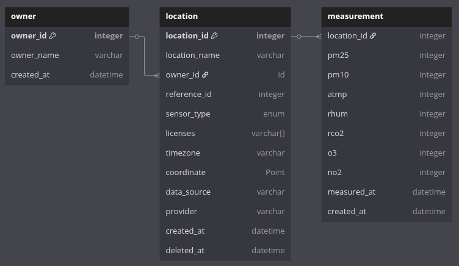

# AirGradient Map API

AirGradient Map API is a backend service that stores and serves air quality data from various sources

## Technical Overview

### Backend Service

API docs are available [here](https://map-data-int.airgradient.com/map/api/v1/docs) or if service available locally, go to http://localhost:3000/map/api/v1/docs. 

#### Tasks

The AirGradient Map API also runs a task that acts as a cron job, retrieving sensor locations and measurements from various data sources. The task is as follow:

1. Every 15 minutes: sync and retrieve sensor location with its latest measures from AirGradient public API
2. Every day at midnight: sync sensor location from OpenAQ with _Reference_ type and specific provider (EEA, Air4Thai, AirNow)
3. Every 1 hour: retrieve the latest sensor measurements from all records with OpenAQ as the data source 

### Database

Database is PostgreSQL with 2 extensions [PostGIS](https://postgis.net/) and [pg_timeseries](https://github.com/tembo-io/pg_timeseries). PostGIS is used for everything related to geospatial data such as storing coordinates, clustering, etc. pg_timeseries is used to convert the measurements table into a time series table, that will make maintaining partition table easier. Partition duration is set to 1 week.

#### DB Schema



**Description**

- owner ➝ store owners of every sensors available on location table
- location ➝ store sensors with each sensor have a unique properties such as coordinates, locations name, etc 
  - location_id ➝ actual location id that provided by this service when sensor pulled from source 
  - location_name ➝ the location name of the sensor
  - reference_id ➝ location id of the sensor that provided by its source 
  - sensor_type ➝ type of the sensor in enum type between  `Small Sensor` or `Reference`
  - licences ➝ license of the sensor 
  - timezone ➝ location timezone of the sensor in string format (eg. `Asia/Bangkok`)  
  - coordinate ➝ coordinate of the sensor location in postgis _Point_ data type 
  - data_source ➝ from which platform the sensor data is retrieved 
  - provider ➝ which instances/entity that provide the sensor 
- measurement ➝ store sensors measurements data 

## Development Setup

Prerequisite: Docker

Spin up both the database and api services from the root of the repository:

```sh
docker compose --env-file .env.development -f docker-compose-dev.yml up [-d] [--build]
```

This automatically builds and starts the necessary containers. When developing and changing source files, the api service automatically reloads the source files. Use the `--build` option when you change npm dependencies and need to rebuild the image. Optionally use the `-d` option for running detached in the background.

To stop the services, run:

```sh
docker compose --env-file .env.development -f docker-compose-dev.yml down
```

### Configure env configuration 

From `.env.development` the only necessary thing needs to be changed is `API_KEY_OPENAQ` configuration. To get the key, please follow steps from OpenAQ [here](https://docs.openaq.org/using-the-api/api-key)

### Seed Data to the Database

- Download database dump from [here](https://drive.google.com/drive/folders/1DU66VaaAoA4704MBNQtk9irZ0QVrO1kO?usp=sharing)
- Copy db dump to db container

```bash
docker cp agmap.dump postgrex:/tmp/
```

- Restore database 

```bash
docker exec -it postgrex pg_restore -U postgres -d agmap -v /tmp/agmap.dump
```

- Make sure database ready

```bash
docker exec -it postgrex psql -U postgres -d agmap -c "select count(*) from location;"
```

Expected Result

``` bash
 count
-------
  9215
(1 row)
```

## License

This project is licensed under the GNU General Public License v3.0 (GPL-3.0).
